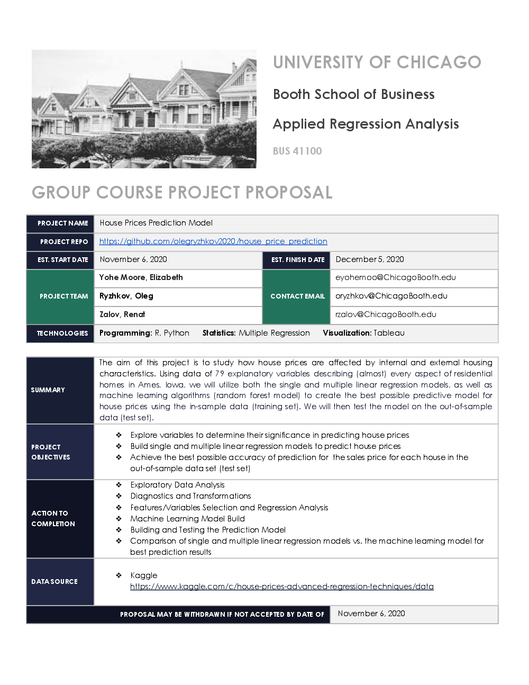

# House Prices Prediction Model

* The aim of this project is to study how house prices are affected by internal and external housing characteristics.
* Data Source: https://www.kaggle.com/c/house-prices-advanced-regression-techniques/data

#### Project Team
* Yohe Moore, Elizabeth
* Ryzhkov Oleg
* Zalov, Renat

## Project Presentation

https://public.tableau.com/profile/oleg2035#!/vizhome/Dashboard-Side-Nav_16062573842670/Start

## Project Description

